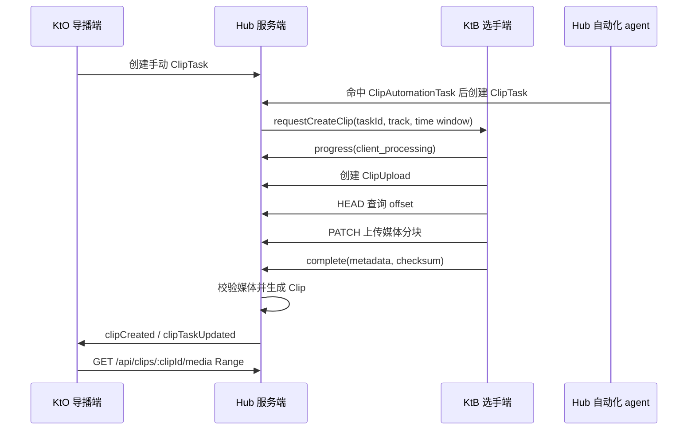

# 精彩回放设计文档

精彩回放用于在比赛直播中快速获取选手端本地录制的精彩片段，由导播端选择播放给观看者。首版范围只覆盖 KtB（选手端）到 Hub 到 KtO（导播端）的链路，不纳入 KtS 机位端。

本阶段只定义设计、数据模型、协议边界和验收标准，不实现代码。

## 目标

- Hub 负责持久化管理自动化任务、具体切片任务、上传会话和最终切片元数据。
- KtB 在比赛期间持续本地录制各 track 的分段媒体文件，并按 Hub 的切片请求从本地分段中拼接出片段。
- KtB 使用 HTTP 断点续传把已编码媒体文件上传到 Hub。
- KtO 通过 Hub 列出切片、接收切片创建通知，并使用 HTTP Range 流式读取媒体。
- Hub 首版使用本地文件系统保存媒体文件，使用 SQLite 保存持久化元数据。

## 非目标

- 不设计比赛事件注入接口，不要求 RankLand Web 或 KtO 把比赛事件推送给 Hub。
- 不实现自动 trigger 检查 agent、子进程派发、比赛数据轮询或订阅机制。
- 不要求 Hub 首版转码或修复媒体文件；Hub 只做校验和必要元数据补验。
- 不支持多 Hub 实例共享同一媒体库；SQLite 和本地文件系统按单实例自托管设计。

## 角色职责

### Hub 服务端

- 保存 `ClipAutomationTask`，即“当某类条件满足时应如何创建切片任务”的配置。
- 保存 `ClipTask` 长任务，维护状态、进度、错误、重试次数和来源。
- 通过 Socket.io 向指定 KtB 下发 `requestCreateClip` 请求。
- 提供断点上传 HTTP 接口，接收 KtB 上传的媒体文件。
- 校验上传的大小、checksum、容器、时长和关键媒体元数据。
- 保存 `Clip` 可播放记录，并向 KtO 通知 `clipCreated`。
- 提供切片列表、缩略图、媒体 Range 读取、删除和保留策略管理。

### KtB 选手端

- 赛时全程按 track 分段滚动录制，并维护本地 manifest。
- 接收 Hub 的 `requestCreateClip`，按服务端时间窗定位本地分段。
- 拼接或截取出目标片段，优先保留编码流，不主动重编码。
- 使用 ffprobe/ffmpeg 提取媒体元数据和缩略图。
- 使用 Hub 的断点上传接口上传媒体和缩略图，并报告任务进度。

### KtO 导播端

- 使用 Hub 接口列出、筛选和读取切片。
- 订阅 Hub 的切片任务和切片创建事件。
- 自行决定如何在导播 UI、OBS 源或直播编排中消费切片。

### 自动化 agent

自动化 agent 是未来归属于 Hub 服务端的独立脚本或子进程，本计划只定义它的存储和接口边界：

- agent 读取 Hub 保存的 `ClipAutomationTask`。
- agent 自行检查 trigger 条件，例如比赛 FB、AC、榜单变化等。
- agent 命中条件后调用 Hub 的任务创建接口创建 `ClipTask`。
- agent 将一次命中的执行记录写入 `ClipAutomationRun`。

本计划不规定 agent 的进程模型、调度方式、数据源、锁实现和失败恢复策略。

## 核心术语

- `ClipAutomationTask`：Hub 持久化保存的自动化配置，例如“当出现 FB 时，请求该选手各个 track 的前 20 秒到后 10 秒片段”。
- `ClipAutomationRun`：自动化任务的一次命中或执行记录，用于追踪该自动化任务生成了哪些 `ClipTask`。
- `ClipTask`：一次具体的切片索取长任务，可由导播手动创建，也可由未来 agent 根据自动化任务创建。
- `ClipTaskItem`：`ClipTask` 中针对某一个 track 的请求项。一个任务可以包含多个 track。
- `ClipUpload`：KtB 针对某个 `ClipTaskItem` 创建的一次断点上传会话。
- `Clip`：最终可被导播端读取和播放的媒体文件记录。

## 总体流程



## 时间模型

所有跨端切片请求都使用服务端毫秒时间戳：

- `startServerMs`：请求切片开始时间。
- `endServerMs`：请求切片结束时间。
- `eventServerMs`：自动化任务命中的事件参考时间，仅由未来 agent 写入运行记录。

KtB 通过 `getContestInfo` 返回的 `serverTimestamp` 估算本机时钟和 Hub 时钟的偏移。KtB 的本地录制 manifest 必须记录每个媒体分段对应的服务端时间范围：

```ts
interface LocalRecordingSegment {
  trackId: string;
  localPath: string;
  startServerMs: number;
  endServerMs: number;
  durationMs: number;
  container: 'mp4' | 'webm';
  codecs: string[];
}
```

如果 KtB 无法可靠覆盖请求时间窗，应返回 `recording_range_missing`，由 Hub 将对应任务项标记为不可重试失败。

## 自动化任务模型

自动化任务是 Hub 的持久化配置，不代表正在执行的后台进程。它描述“将来 agent 命中条件后应创建怎样的 `ClipTask`”。

```ts
type ClipAutomationTriggerKind = 'manualOnly' | 'firstBlood' | 'accepted';

interface ClipAutomationTask {
  automationId: string;
  uca: string;
  name: string;
  enabled: boolean;
  trigger: {
    kind: ClipAutomationTriggerKind;
    problemAliases?: string[];
    includeUnofficial?: boolean;
  };
  target: {
    userSelector: 'eventUser';
    trackIds: string[];
  };
  clipWindow: {
    preRollMs: number;
    postRollMs: number;
    minDurationMs: number;
    maxDurationMs: number;
  };
  defaults: {
    category: 'firstBlood' | 'accepted' | 'manual' | 'other';
    titleTemplate: string;
    tags: string[];
    priority: 'low' | 'normal' | 'high';
  };
  createdAt: number;
  updatedAt: number;
}
```

`manualOnly` 用于保存一组可复用的默认参数，但不会被自动化 agent 主动触发。

## 切片任务状态机

`ClipTask.status` 使用以下状态：

- `queued`：任务已创建，等待 Hub 下发给 KtB。
- `requested`：Hub 已向 KtB 发送 `requestCreateClip`。
- `client_processing`：KtB 正在本地定位、拼接、提取元数据。
- `uploading`：KtB 正在上传媒体或缩略图。
- `verifying`：Hub 正在校验文件和元数据。
- `ready`：至少一个任务项已生成可播放 `Clip`，且没有未完成项。
- `partial_ready`：部分任务项成功，部分任务项失败。
- `failed`：任务整体失败。
- `cancelled`：任务被管理端取消。
- `expired`：任务产物已超过保留期限。

每个 `ClipTaskItem` 也维护独立状态。多 track 任务中，一个 track 失败不应阻止其他 track 生成 `Clip`。

## 重试与错误

Hub 只对可重试错误自动重试：

- KtB 临时离线。
- Socket.io 下发超时。
- 上传网络中断。
- Hub 校验阶段遇到临时文件锁或短暂 IO 错误。

以下错误不可重试：

- `track_not_found`：请求 track 不存在。
- `recording_range_missing`：KtB 本地录制无法覆盖时间窗。
- `invalid_time_window`：请求时间窗非法。
- `media_validation_failed`：媒体文件校验失败。
- `upload_checksum_mismatch`：checksum 不一致。

任务记录必须包含：

```ts
interface ClipTaskProgress {
  attempts: number;
  maxAttempts: number;
  progress: number; // 0-100
  errorCode?: string;
  errorMessage?: string;
  updatedAt: number;
}
```

## 存储设计

### SQLite 表

首版建议 SQLite 表如下：

- `clip_automation_tasks`：自动化任务配置。
- `clip_automation_runs`：自动化任务命中记录。
- `clip_tasks`：具体切片长任务。
- `clip_task_items`：任务中的 track 级请求项。
- `clip_uploads`：断点上传会话。
- `clips`：最终可播放切片。

所有表都必须包含 `uca`，便于按比赛隔离查询和清理。

关键字段：

```ts
interface ClipRecord {
  clipId: string;
  uca: string;
  taskId: string;
  itemId: string;
  userId: string;
  trackId: string;
  source: 'manual' | 'automation';
  category: 'firstBlood' | 'accepted' | 'manual' | 'other';
  title: string;
  tags: string[];
  mediaPath: string;
  thumbnailPath?: string;
  mimeType: string;
  byteSize: number;
  durationMs: number;
  width?: number;
  height?: number;
  videoCodec?: string;
  audioCodec?: string;
  checksumSha256: string;
  actualStartServerMs: number;
  actualEndServerMs: number;
  status: 'ready' | 'deleted' | 'expired';
  createdAt: number;
  expiresAt: number;
}
```

### 文件布局

默认存储根目录由 `CLIP_STORAGE_DIR` 指定，未配置时使用 Hub 应用数据目录。

```text
{CLIP_STORAGE_DIR}/
  {uca}/
    clips/
      {clipId}/
        media.mp4
        thumbnail.webp
        metadata.json
    uploads/
      {uploadId}.part
```

SQLite 中只保存相对路径或规范化后的安全路径，禁止保存客户端提供的原始绝对路径。

## 媒体规范

首版推荐媒体格式：

- 优先：`video/mp4`，H.264 + AAC。
- 兼容：`video/webm`，VP8/VP9 + Opus。

Hub 首版不转码。KtB 上传前应尽量使用 stream copy 拼接或截取。为提高切片精度，KtB 录制时应控制关键帧间隔，推荐关键帧间隔不超过 2 秒，并保持同一 track 的分段容器、编码器、分辨率、帧率和音频参数一致。

KtB 需要保存本地 manifest，便于查找覆盖请求时间窗的多个分段。若需要跨多个分段拼接，分段流参数必须一致；否则 KtB 应返回失败，不能上传不可预测的媒体文件。

## 上传协议选择

上传采用 TUS 风格简化协议：

- `POST` 创建上传会话。
- `HEAD` 查询已接收偏移。
- `PATCH` 携带 `Upload-Offset` 追加二进制分块。
- `POST complete` 提交最终元数据并触发 Hub 校验。

该设计只采用 TUS 的核心 offset 语义，不承诺完整兼容 TUS 客户端生态。

## 技术调研结论

- TUS 的核心模型适合本功能：客户端先创建上传会话，再用 `HEAD` 查询偏移，用 `PATCH` 从指定 `Upload-Offset` 继续追加上传。首版只需要这一组语义，不需要完整实现 TUS extension。
- HTTP Range 是导播端流式播放的通用基础。Hub 媒体读取接口必须支持 `Accept-Ranges: bytes`、`206 Partial Content` 和越界 `416 Range Not Satisfiable`。
- FFmpeg 的分段与拼接能力可满足 KtB 本地截取需求，但精确切片依赖关键帧。KtB 录制时应控制关键帧间隔，并确保同一 track 的分段编码参数一致，才能可靠使用 stream copy 或 concat 方式生成片段。

## 保留与清理

默认 `expiresAt` 为比赛结束后 30 天。若 Hub 无法获取比赛结束时间，则使用切片创建时间后 30 天。

删除行为分两种：

- 软删除：`Clip.status = 'deleted'`，媒体文件进入异步清理队列。
- 过期：`Clip.status = 'expired'`，媒体文件可由清理任务删除。

KtO 列表默认不返回 `deleted` 和 `expired` 切片。

## 鉴权与安全

- 管理和导播接口沿用 Hub 当前 `X-Token` 或 `directorToken` 体系。
- KtB 上传接口必须校验 `uca`、`taskId`、`uploadId` 和短期 upload token 的绑定关系。
- upload token 只允许访问对应任务项和上传会话，不允许列出或下载其他切片。
- Hub 必须限制单文件大小、单任务 track 数量、切片最大时长和总存储配额。
- 媒体读取接口只接受 Hub 数据库中已登记的 `clipId`，不接受任意路径。

## 运维配置

建议增加以下配置项：

```text
CLIP_STORAGE_DIR=/var/lib/rankland-broadcast-hub/clips
CLIP_SQLITE_PATH=/var/lib/rankland-broadcast-hub/clips.sqlite
CLIP_MAX_DURATION_MS=120000
CLIP_MAX_UPLOAD_BYTES=524288000
CLIP_DEFAULT_RETENTION_DAYS=30
CLIP_UPLOAD_TOKEN_TTL_MS=900000
CLIP_TASK_MAX_ATTEMPTS=3
```

## 验收标准

- 手动创建单 track `ClipTask` 后，KtB 能收到 `requestCreateClip` 并上传，Hub 生成 `ready` 切片。
- 创建“FB 自动化任务”配置后，Hub 能完整保存 trigger、目标选择、时间窗、分类、启用状态。
- 未来 agent 可读取自动化任务并通过统一任务创建接口生成 `ClipTask`，同时写入 `ClipAutomationRun`。
- KtB 离线、track 不存在、录制范围缺失时，Hub 能给出明确失败状态和错误码。
- 上传中断后，KtB 能通过 `HEAD` 获取 offset 并继续上传。
- Hub 校验失败时，不生成 `ready` 切片。
- KtO 能通过列表接口看到切片，并通过 HTTP Range 播放媒体。
